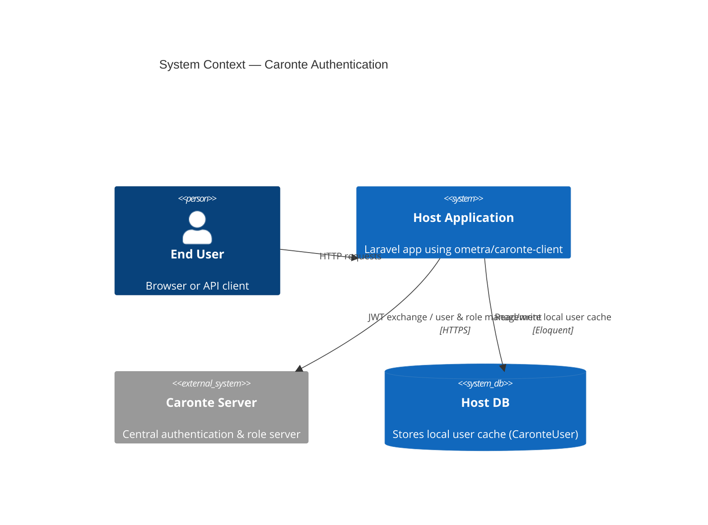
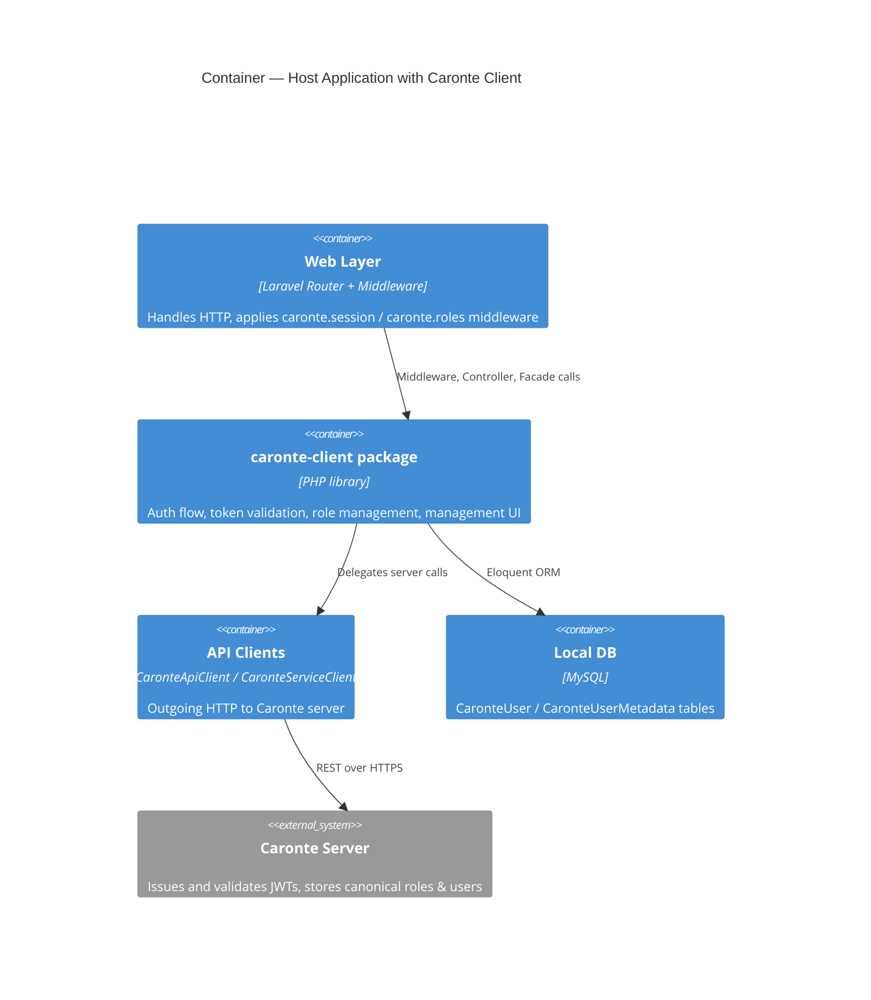
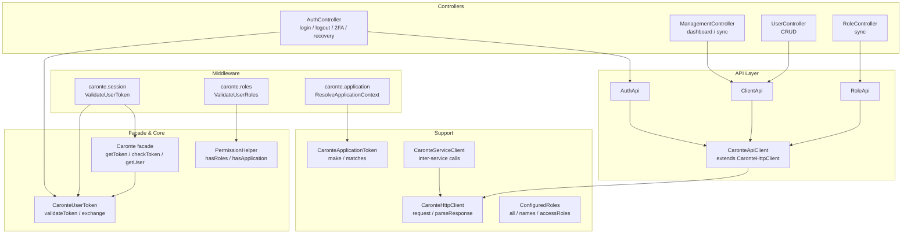
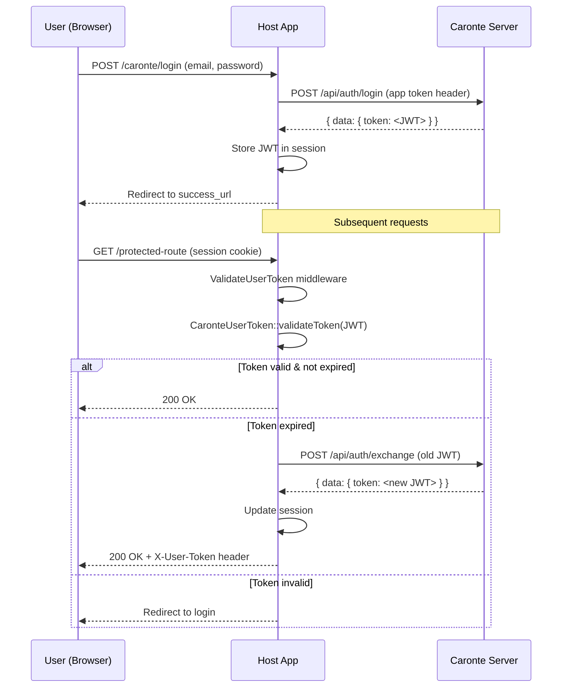
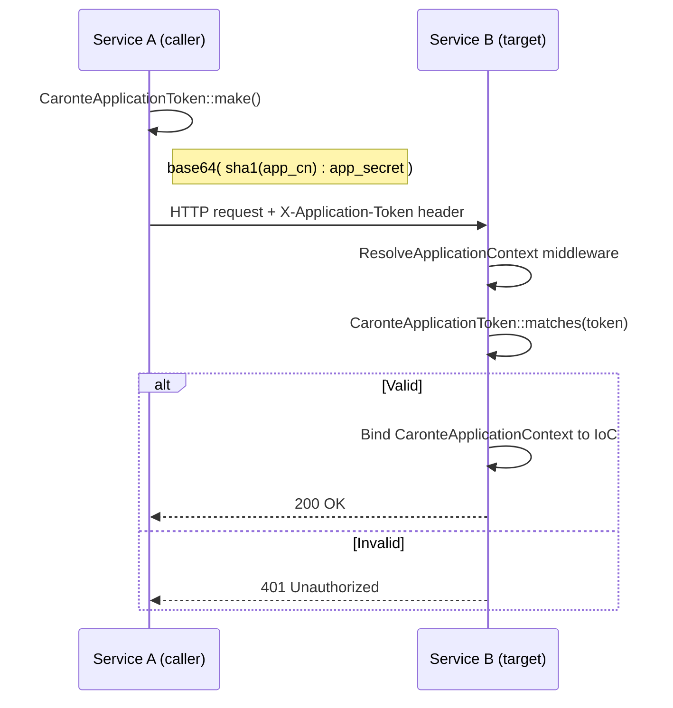

# Architecture Diagrams

---

## 1. System Context



---

## 2. Container Diagram



---

## 3. Component Diagram



---

## 4. Authentication Flow Sequence



---

## 5. Application Token Flow



---

## 6. Package Directory Structure

```
src/
├── Caronte.php                  # Main facade class (user token management)
├── CaronteServiceClient.php     # Inter-service HTTP client (public API)
├── CaronteUserToken.php         # JWT parse/validate/exchange
├── Api/
│   ├── AuthApi.php              # Static proxy — auth endpoints
│   ├── CaronteApiClient.php     # HTTP client for Caronte server
│   ├── ClientApi.php            # Static proxy — user endpoints
│   └── RoleApi.php              # Static proxy — role endpoints
├── Console/Commands/            # Artisan commands
├── Contracts/                   # SendsTwoFactorChallenge, SendsPasswordRecovery
├── Facades/                     # Caronte facade alias
├── Helpers/
│   ├── CaronteUserHelper.php
│   └── PermissionHelper.php
├── Http/
│   ├── Controllers/             # Auth, Management, User, Role controllers
│   └── Middleware/              # ValidateUserToken, ValidateUserRoles, ResolveApplicationContext
├── Mail/                        # Mailable classes for host-delivery mode
├── Models/                      # CaronteUser, CaronteUserMetadata
├── Notifications/               # Default sender implementations
├── Providers/
│   └── CaronteServiceProvider.php
└── Support/
    ├── CaronteApplicationContext.php  # DTO bound by ResolveApplicationContext
    ├── CaronteApplicationToken.php    # App token generation & validation
    ├── CaronteHttpClient.php          # Abstract HTTP base (template method)
    ├── CaronteResponse.php            # Normalised response DTO
    ├── ConfiguredRoles.php            # Reads config('caronte.roles')
    └── RequestContext.php
```
