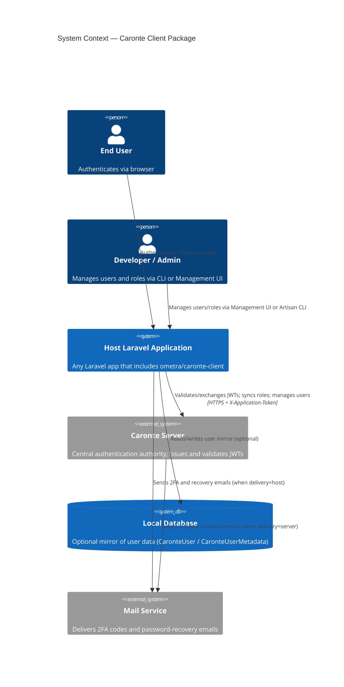
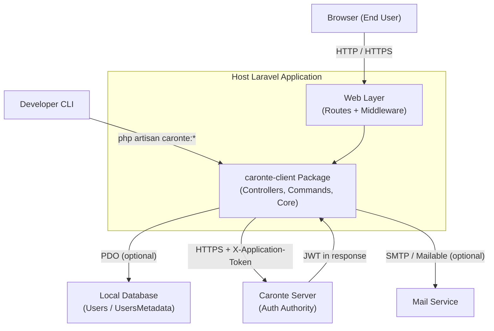
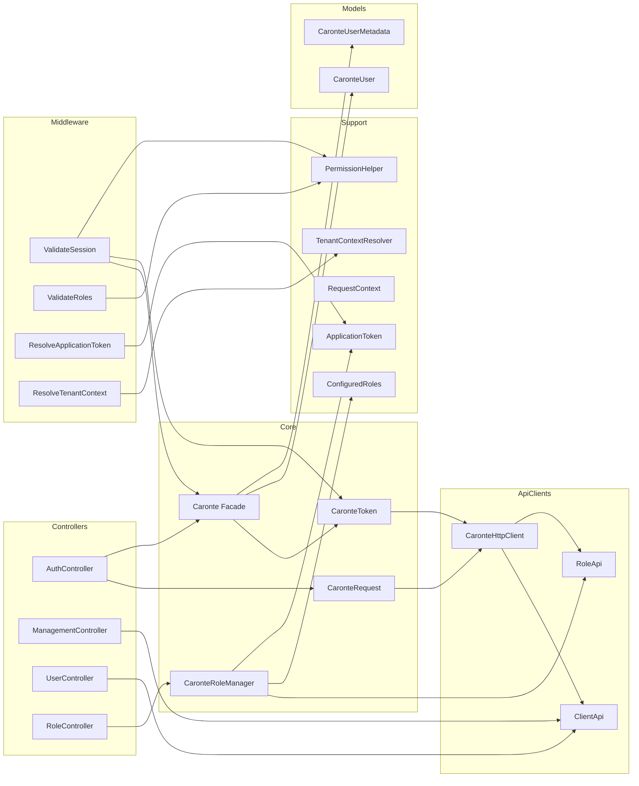
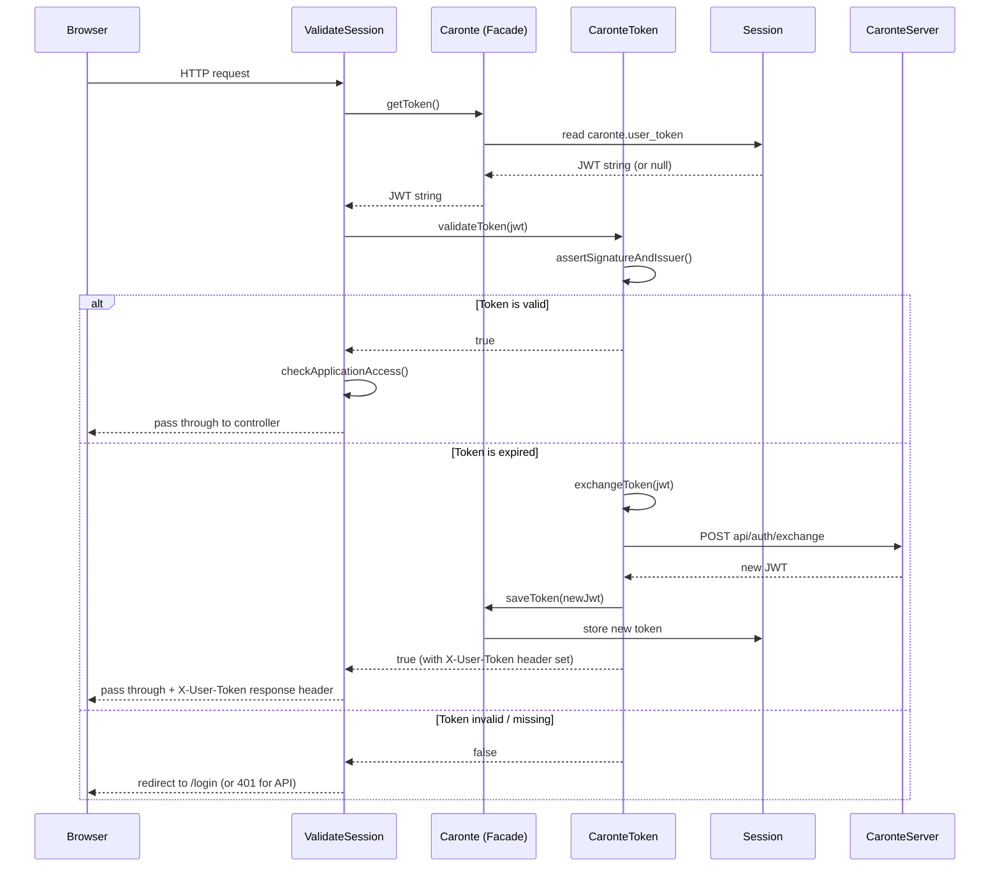
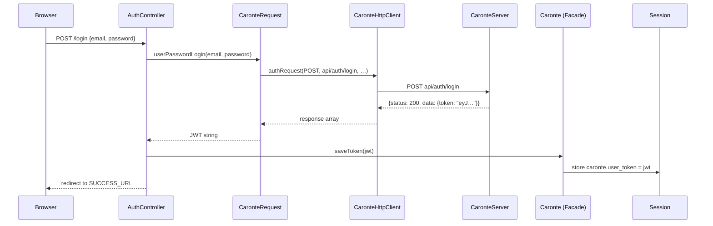

# Architecture Diagrams

## 1. System Context (C4 Level 1)

---

## 2. Container Diagram (C4 Level 2)

---

## 3. Component Diagram

---

## 4. Per-Request JWT Validation Sequence

---

## 5. User Authentication Sequence

