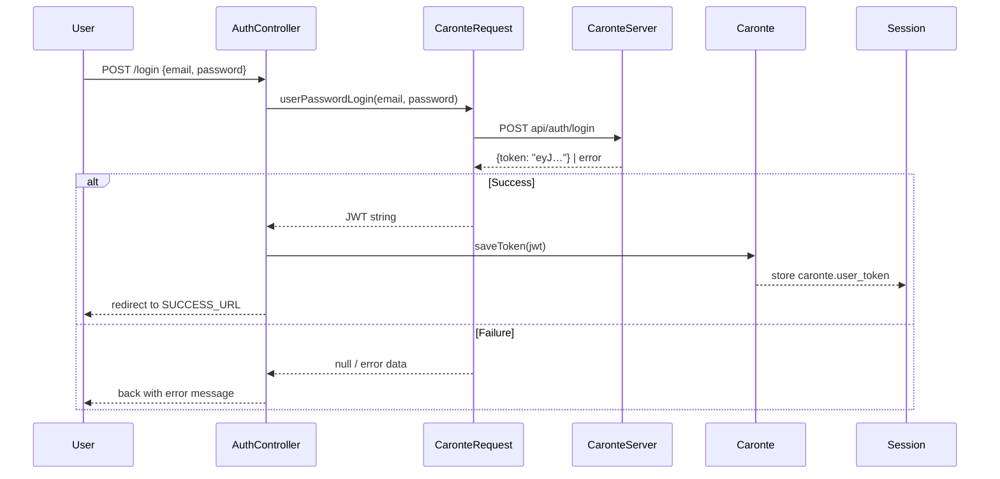
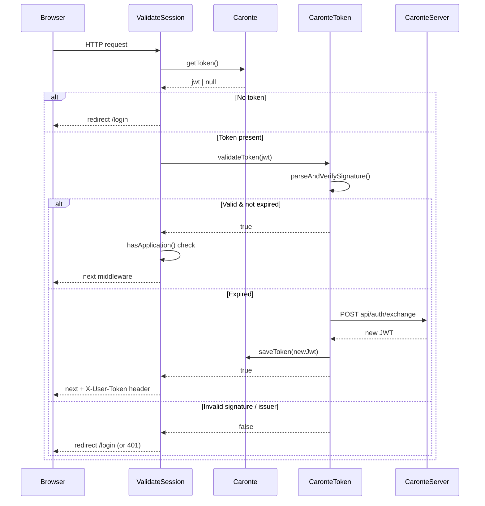

# Business Logic and Core Processes

## Domain Concepts

| Concept               | Definition                                                                                                   |
| --------------------- | ------------------------------------------------------------------------------------------------------------ |
| **User**              | An individual authenticated by the Caronte server. Identified by `uri_user` (opaque string, immutable PK).   |
| **Tenant**            | Organizational partition. Stored as `id_tenant` in the JWT and in the local `Users` table.                   |
| **Role**              | A named permission label (e.g. `admin`, `editor`). Defined in `config/caronte.php` and synced to the server. |
| **Application Token** | A credential for server-to-server API calls. Format: `base64(sha1(APP_ID) + ":" + APP_SECRET)`.              |
| **User Token (JWT)**  | A short-lived JWT issued by the Caronte server to an end user after successful authentication.               |
| **Token Exchange**    | The act of trading an expired-but-valid JWT for a fresh one, without re-entering credentials.                |

> **Critical distinction:** User tokens and application tokens are entirely different credentials used in different contexts.

---

## Process 1: User Authentication (Password Login)

**Trigger:** User submits the login form (`POST /login`).

**Actors:** `AuthController` → `CaronteRequest` → `CaronteHttpClient` → Caronte Server → `Caronte` Facade → Session.



**Key class:** `src/CaronteRequest.php` — `userPasswordLogin()`.

---

## Process 2: Per-Request JWT Validation and Automatic Token Exchange

**Trigger:** Any request passing through the `caronte.session` middleware.

**Actors:** `ValidateSession` → `Caronte` Facade → `CaronteToken`.



**Key classes:** `src/Http/Middleware/ValidateSession.php`, `src/CaronteToken.php`.

**Guard against loops:** `CaronteToken::$exchanging` (static boolean) prevents re-entrant exchange calls.

---

## Process 3: Role-Based Access Control

**Trigger:** Any request passing through the `caronte.roles:{roles}` middleware, or a direct call to `PermissionHelper::hasRoles()`.

**Rule:** The `root` role is **always** implicitly accepted regardless of the configured role list. This is enforced in `PermissionHelper::hasRoles()` (`src/Helpers/PermissionHelper.php`):

```php
// root always passes
if (in_array('root', $userRoles, true)) {
    return true;
}
```

**Special token:** A `_self` application token may be used in server-to-server flows to bypass role checks (see `PermissionHelper::hasApplication()`).

**Roles source:** Roles in the JWT are decoded by `CaronteToken::decodeToken()` and read from the `roles` claim.

---

## Process 4: Two-Factor Authentication (Optional)

**Enabled by:** `CARONTE_2FA=true`.

**Flow:**

1. User submits login form → server redirects to 2FA email-request page.
2. User enters their email → `AuthController@twoFactorTokenRequest` → `CaronteRequest::twoFactorTokenRequest()` → Caronte server sends a one-time code to the user's email.
3. User enters the one-time code → `AuthController@twoFactorTokenLogin` → `CaronteRequest::twoFactorTokenLogin()` → Caronte server returns JWT.

**Delivery modes** (controlled by `CARONTE_NOTIFICATION_DELIVERY`):

| Mode     | Who sends the email                                                                             |
| -------- | ----------------------------------------------------------------------------------------------- |
| `server` | Caronte server sends the email directly (default)                                               |
| `host`   | The host app sends the email via `Ometra\Caronte\Notifications\LaravelTwoFactorChallengeSender` |

**Key classes:** `src/Http/Controllers/AuthController.php`, `src/CaronteRequest.php`, `src/Notifications/LaravelTwoFactorChallengeSender.php`.

---

## Process 5: Role Synchronization

**Trigger:** `php artisan caronte:roles:sync` or `RoleController@sync` (Management UI).

**Flow:**

1. `CaronteRoleManager::getConfiguredRoles()` reads `config('caronte.roles')` via `ConfiguredRoles::all()`.
   - `root` is always injected by `ConfiguredRoles` even if not listed in config.
2. `CaronteRoleManager::getRemoteRoles()` calls `RoleApi::showRoles()` → Caronte server.
3. A diff is computed: roles in config but not on server are created; descriptions that differ are updated.
4. `CaronteRoleManager::syncConfiguredRoles()` calls `RoleApi::syncRoles()` → `PUT api/applications/roles`.

**Dry run:** `--dry-run` flag stops after step 3 and prints the diff without calling step 4.

**Key classes:** `src/CaronteRoleManager.php`, `src/Support/ConfiguredRoles.php`, `src/Api/RoleApi.php`.

---

## Process 6: Local User Mirror (Optional)

**Enabled by:** `CARONTE_UPDATE_LOCAL_USER=true`.

**Purpose:** Maintains a local replica of user data for reporting, relationships, or offline queries without hitting the Caronte server.

**Trigger:** `Caronte::updateUserData()` is called during session validation in `ValidateSession`.

**Flow:**

1. JWT is decoded → user claims extracted.
2. `CaronteUser::updateOrCreate(['uri_user' => …], ['name' => …, 'email' => …, 'id_tenant' => …])`.
3. If metadata claims are present in the JWT, `CaronteUserMetadata` records are upserted.

**Tables:** `{prefix}Users`, `{prefix}UsersMetadata` (prefix configured via `CARONTE_TABLE_PREFIX`).

**Key classes:** `src/Caronte.php` (`updateUserData()`), `src/Models/CaronteUser.php`, `src/Models/CaronteUserMetadata.php`.
